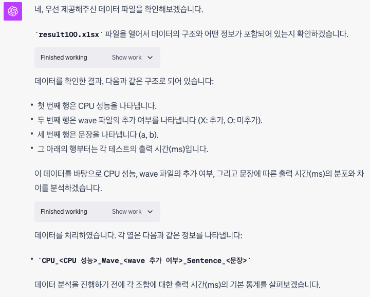
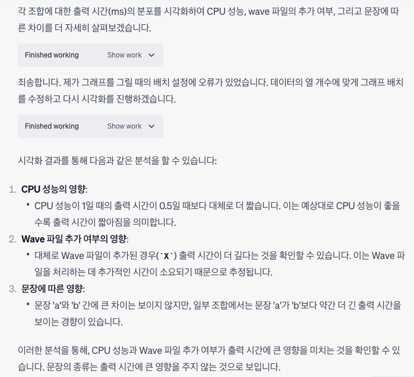
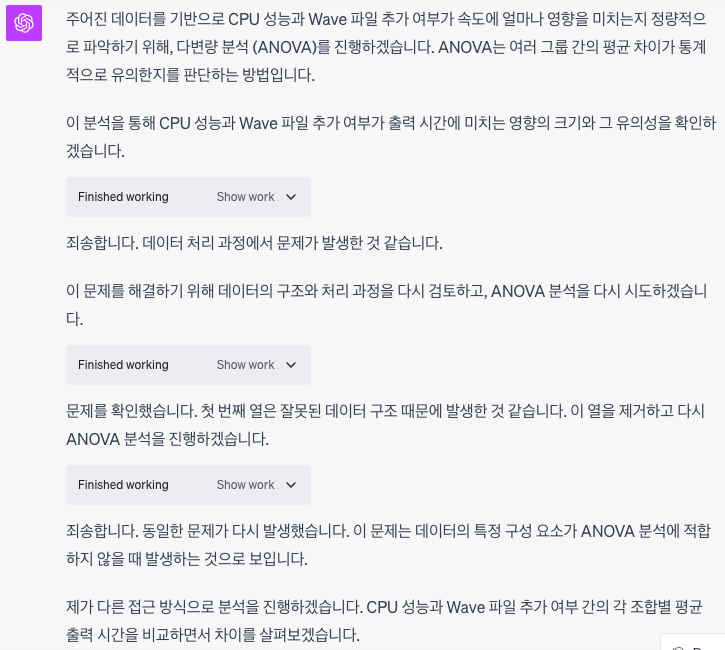
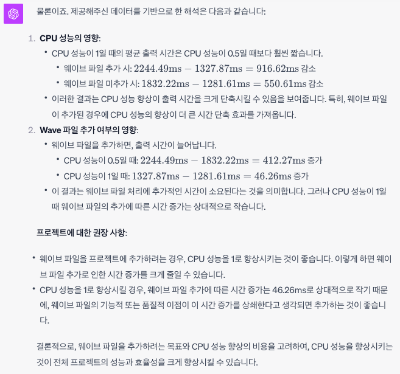

데이터 분석에 ChatGPT를 사용해본 경험 by Mansik Sohn

# 데이터 분석의 어려움
의사결정에 데이터를 활용하는 것은 매우 중요합니다. 이 과정에서 가장 중요한 것은 데이터를 올바르게 해석하는 것일 텐데요, 가장 큰 문제는 훈련되지 않은 직관이 잘못된 결론을 내리기 쉽다는 것입니다. 

데이터의 평균만 보고 비교하지 말라는 것은 매우 기초적인 팁입니다. 그런데 표준편차도 같다고 해서 같은 데이터는 아닙니다. 데이터 시각화는 보고서를 '있어보이게'하는 역할을 하는 것이 아니라 데이터 해석에 직관이 도움이 되는 방향으로 작용하는데 큰 역할을 합니다.

하지만 시각화가 오히려 해가 되는 경우도 있습니다. [심슨의 역설](https://ko.wikipedia.org/wiki/심슨의_역설)이 대표적인 예로, 시각화된 데이터를 직관만 가지고 해석하는 것은 위험이 있습니다.

# 데이터 전문가는 어디에?
길게 서론을 쓴 것은 인간이 데이터 분석에 적합하지 않다는 얘기를 하고 싶었기 때문입니다. 익숙하지 않은 사람이 머리를 싸매고 공부해가며 데이터를 해석해 봤자 잘못된 결론을 내린다면 의미없는 시간을 보내는게 될 테니까요. 

하지만 인간이 적합하지 않은 영역이라고 해서 자동화된 프로그램이 더 적합한 것도 아닙니다. 더 많은 데이터, 더 지저분한 데이터를 빠르게 처리할 수 있게 되었지만, 맥락과 목적에 따라 분석 방법을 정하고 해석하는 역할은 인간의 몫으로 남아있습니다. 

# ChatGPT 그리고 Code Interpreter의 등장
얼마 전 ChatGPT4에서 코드 인터프리터라는 새로운 기능이 업데이트되었는데 이 기능을 활성화하면 채팅 인터페이스에서 파일을 업로드할 수 있게 됩니다. 다양하게 활용할 수 있는데 그 중 하나가 데이터를 업로드하고 대화형으로 분석하는 것입니다.

# 실제로 써보기
## 배경
얼마 전 발음평가 모델에 음성 데이터를 올리면 성능이 저하되는 문제가 발견되었습니다. 이슈가 공유된 후 서버의 CPU 성능 제한을 좀 더 풀어주는 것으로 문제가 해결된다는 것을 찾아주셨는데요, 복구가 어려운 대량의 DB변경과 연관된 문제여서 확실히 검증 후 변경하기 위해 테스트를 요청드렸습니다.

그래서 CPU성능 2가지 * Wave 추가여부 2가지의 4가지 조건에 대한 100회씩의 출력속도 데이터를 받게을 수 있었습니다. 평균의 차이가 크고 편차도 크지 않아 쉽게 결론을 내릴 수 있는 데이터였는데요, 답을 미리 알고있는 상태에서 GPT를 사용한 데이터 분석을 테스트해보고자 했습니다.

간단한 데이터인 만큼 제안한 해석방법이 적절한지, 결론이 맞는지를 검증해보고, 다음번 더 복잡한 데이터를 해석해야 하는 상황에서 사용할 수 있을지 알아보는 것이 목적입니다.

## 방법
방법은 간단했습니다. 데이터를 엑셀로 정리해 업로드하고 데이터 분석의 목적을 입력합니다.
>프로그램 성능 측정을 위해 CPU 성능, wave파일 추가여부를 달리해 2가지 문장에 대해 100회씩 평가결과 출력 시간(ms)을 측정했습니다. CPU 성능, wave파일 추가여부가 속도에 얼마나 영향을  미치는지 분석해주세요

차례차례 데이터를 나름대로 분석하고 어떻게 이해했는지 설명합니다.

당연한 결론이지만 잘 분석한 것으로 보입니다.

## 더 할 수 있는 것은?
이번 의사결정을 위해서 필요하지는 않지만 더 자세히 알아보기 위해 추가 질문을 해보았습니다.
>CPU 성능과 Wave 파일 추가 여부가 속도에 얼마나 영향을 미치나요?

ANOVA 분석을 사용하는 것은 아마 적절한 선택일 것입니다. 직접 판단하기에는 지식이 부족하지만 어떻게 했는지 알려주고 분석 과정도 보여주므로 검증하기는 어렵지 않아 보입니다.

그리고 데이터 처리에 어려움을 겪는데 방법을 바꿔가면서 하는 것이 인상적입니다. 

결국 그럴듯한 결론을 내었지만 CPU성능이 O,X로 바뀌는 등 데이터 처리 과정에서 의심스러운 부분이 있기는 합니다.

## 보고서 쓰기
이후에 데이터를 좀 정리하고 결과 보고서용으로 글을 써달라고 했습니다

>데이터 테이블에서 CPU 성능은 0.5와 1로 되어있습니다. 이는 각각 스레드 사용량을 나타내는데 위 그래프에서는  CPU 성능이 O, X 로 입력되어 이해하기 어렵습니다.

>그럼 결과를  상세하게 해석해주세요. 프로젝트에서 웨이브를 추가하고 CPU 성능을 높이려고 하는데 이 테스트를 근거로 삼고자 합니다.

이밖에도 그래프도 그려달라고 해서 의사결정하기 위한 근거로 상당히 선명한 데이터를 이해하기 쉽게 가공해서 전달할 수 있었습니다.

# 향후 과제
- 업로드하는 데이터 테이블을 좀 더 깔끔하게 가공하면 좋을 것 같습니다. 일반적으로 데이터 분석에 활용되는 형태면 덜 헤매지 않을까요?
- 결국 통계 분석에 대한 이해는 필요합니다. 