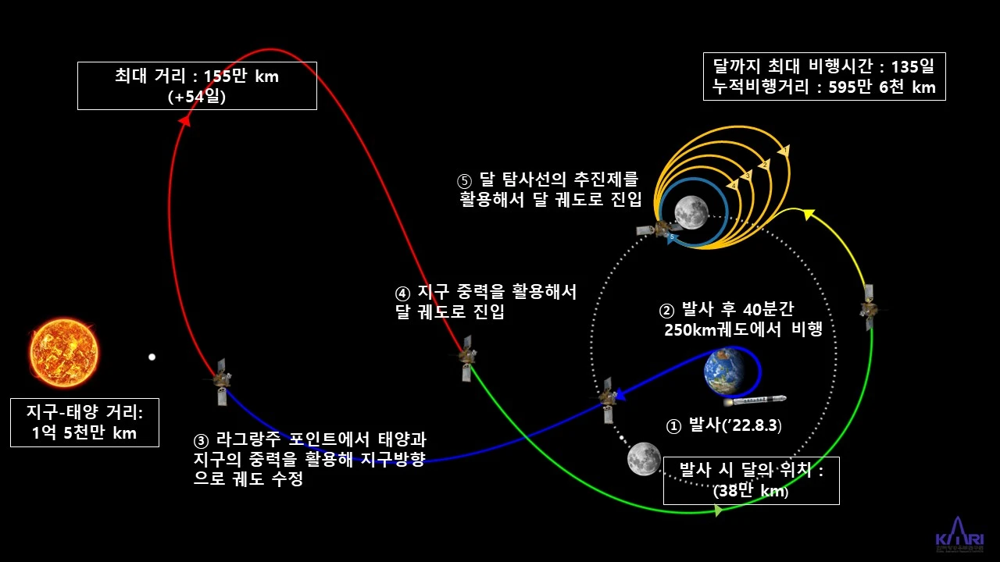
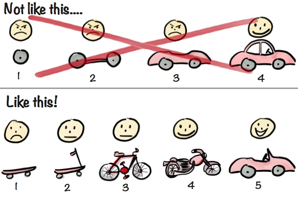

(이전 블로그에서 가져온 글입니다) _Posted by Mansik Sohn, Product Designer, Mediazen AI Edtech team_

# 민첩한 하루를 만드는 방법

프로젝트 설계를 위해 만드는 문서에 대해 고민한 내용을 정리해 보려고 합니다. 애자일을 다시 발견하고, ‘유저 스토리’라는 개념을 이해하고 이를 중심으로 업무를 진행해보자는 제안입니다.

## 우리를 고통스럽게 만드는 것들

전통적인 소프트웨어 개발 방법론들은 계획과 문서화에 집중합니다. 뛰어난 사람들이 충분한 시간을 들여 검증된 설계도를 만드는 것이 중요합니다. 설계도가 완벽하면, 결과(매출)도 일정도 예측 가능하며 불필요한 야근도 하지 않을 수 있습니다. 로켓 발사 같은 프로젝트가 가장 대표적인 예이지 않을까요? 이런 프로젝트에 필요한 것은 충분한 투입(시간, 자본, 인력)과 명확한 목표일 것입니다. 그러나 이런 프로젝트마저도 문제는 필연적으로 발생하고 실패와 재도전을 하는 것이 당연합니다. 

디지털 프로덕트 개발은 어떨까요? 로켓 발사와 비교하면 대단히 작고 간단한 프로젝트 입니다. 하지만 그 이상으로 시간, 자본 인력이 모두 부족하고 목표는 불명확합니다. 모든 기업이 고객만족을 최우선으로 생각한다고 광고하는건, 바꿔 말하면 고객을 만족시키기 쉽지 않다는 의미이기도 합니다. 고객(사용자)을 아무리 분석해도 만족(좋은 사용자 경험)을 만들 방법을 명확히 알기 어렵고, 이를 구현해내는 방법 또한 결정하기 어렵습니다. 마치 종이비행기를 날려 어두운 곳에서 쉴 새 없이 움직이는 목표까지 도달해야 하는 것과 같습니다.

때문에 소규모 프로젝트에 기존의 방법(워터폴)방식을 사용하면 프로젝트 참여자는 엄청난 혼란과 고통을 겪게 되지만 그 결과로 나온 제품은 아쉬운 것인 경우가 많습니다.

첫 번째 이유는 불완전한 설계 입니다. 불명확한 목표에 대해 충분히 이해가 이루어지지 않은 초기 단계에 설계가 이루어집니다. 설계자는 불확실함 속에서 많은 부분을 결정하게 됩니다. 하지만 빠르게 결정되지 않은 부분은 개발 기간의 부족으로 이어지기 때문에 어떻게든 책임을 지고 선택해야 합니다. 그리고 프로젝트 후반부가 가까워지면 목표에 대한 이해도가 증가함에 따라 이미 내렸던 결정이 잘못된 것이었음을 고통스럽게 확인하게 됩니다.

두 번째 이유는 요구사항 변경 입니다. 설계자가 실패의 책임을 안고서 설계를 변경하지 않는다고 해도 클라이언트의 요구, 시장의 변화에 따라 얼마든지 변경이 필요한 상황이 생깁니다. 설계 변경은 곧 개발 일정 추가로 이어지고 끝없는 추가 업무 속에 제품 자체의 완성도는 목표에서 사라지게 됩니다. 잘 설계된 계획은 목표한 요구사항들만 만족해도 완성도 있는 결과물이 나오도록 되어 있겠지만 이미 앞에서 계획 자체가 불완전한 토대 위에서 세워진다는 것을 알아보았습니다.

## 고통을 피할 수 있을까?

어둠 속에서 목표를 맞추는 일은 정말 어렵게 느껴지지만, 다행히도 참고할 수 있는 많은 답들은 이미 많이 나와 있습니다. 사용성 원칙이라고 부르는것도 있고 프레임워크, 라이브러리, 개발방법론 등등이 우리가 사용할 수 있는 컨닝페이퍼일 것입니다.

우리는 여러 힌트들 중 개발방법론으로서 애자일 프레임워크 중 하나인 스크럼 방식을 적용하고 있습니다. "애자일(Agile)"이라는 단어는 "민첩한", "기민한"이라는 의미를 가지고 있다고 하는데요. 소프트웨어 개발 방법론으로서 "애자일"은 변화에 대응할 수 있는 유연성과 빠른 반응성을 강조합니다. 앞에서 말한 문제점을 생각해보면 유연한 구조를 도입하는 것은 필연적입니다. 설계의 불완전함을 인정하고 변경 가능성을 열어두되, 작은 단위로 만들어나가는 것입니다.  

그럼 작은 단위는 무엇일까요? 어떤 방법론이든 작은 단위로 나누는 것은 공통적이지만, 단위를 바라보는 컨셉이 다릅니다.

### 워터폴 방식

전통적인 방법론에서도 작은 단위로 세분화하는 것은 중요합니다. 일의 규모를 파악하고 일정을 산정하는데 필수적인 과정입니다. 여기서는 요구사항과 기능을 기준으로 삼습니다. 이 과정에서 만들어지는 소프트웨어 요구사항 문서에는 다음과 같이 작은 단위가 표현됩니다.

> (요구사항 번호-111): ‘버튼을 눌러 메시지를 보내는 기능’

아주 훌륭한 사람들이(사용자 분석이든 인지과학이든 을 이용해) 최선의 정답을 만들어두었기 때문에 기능에 대해 고민하는 것은 불필요한 낭비가 됩니다.

### 애자일 방식

반면 애자일에서는 작은 단위로 ‘유저 스토리’를 사용합니다.

[Atlassian의 사용자 스토리 소개](https://www.atlassian.com/ko/agile/project-management/user-stories)에서는 유저 스토리란 ‘소프트웨어 사용자 관점에서 표현한 최종 목표’라고 말합니다. 사용자 스토리의 목적은 어떤 작업이 고객에게 특정 가치를 제공하는 방법을 명확히 설명하는 것입니다. 일반적으로 **"저는 [페르소나]로서, [하고 싶은 일]을 하여 [목적]을 이루고 싶습니다.”** 의 구조로 표현합니다.

위에서 보았던 워터폴 방식에서 ‘버튼을 눌러 메시지를 보내는 기능’이라고 정의되었던 것은 유저 스토리로는 다음과 같이 표현할 수 있습니다.

> ‘나는 선생님으로서, 메시지를 보내 학생들에게 이벤트를 알리고 싶습니다’

사용자의 목표를 이해한 후 팀원들은 이 목표를 달성하기 위해 대화해나가며 해결방법을 찾아나가야 합니다.

## 모든 것을 이어주는 키워드 ‘유저 스토리’

개발 방법론에 대한 글들을 보면 어떤 방식이 절대적으로 우월하다고 말하지는 않습니다. 프로젝트 성격에 따라 다르게 접근해야 하나, 지금 우리가 나아가야 할 방향과 겪는 고민들을 해결할 수 있는 것은 애자일 방식이 맞을 것입니다. 다만 이 방식에 익숙해져가는 과정에서 기획과 디자인, 개발이 이어지는 부분은 워터폴 방식에서 사용하던 요소들을 차용하면서 생기는 문제점이 있다고 생각했습니다.

같은 기능에 대해 다른 방향으로 접근하는것은 큰 차이를 만들어낼 수 있다고 하는데 여러 글에서 말하는 내용은 다음과 같습니다

- 개발자, 기획자, 디자이너, 사용자 등 모든 이해관계자가 목표에 대해 비슷한 수준으로 이해할 수 있다
- 구현 방법에 대한 방법을 제한하지 않으므로 결정이 필요한 순간에 대화를 통해 최적의 선택을 할 수 있다
- 선택 과정에서 결정의 기준이 사용자의 목표와 일치되므로 기능만 가지고 생각하는 것보다 최종 사용자에게 가치있는 해결책을 찾기 쉽다

기획과 디자인이 사용자를 고려해 만들어졌다고 해도 이를 개발과정으로 전달하는 부분이 잘 이루어지지 않으면 큰 오차가 발생하고 프로젝트 실패의 원인이 될 수 있습니다. 이것을 잘 전달하기 위해 문서를 더 잘 만들고 전달할 방법을 찾았으나 해결책은 전달하는 방법을 바꾸는 것이었습니다. 사용자에게 가치있는 기능을 구현할 방법을 전달하기보단 사용자가 원하는 가치를 공유하고 같이 해결방법을 찾아나가는 것이지요.

당장 완벽하지는 않지만, 앞으로 프로젝트를 진행해나가는 과정에서 이 개념에 대한 이해를 공유하고 어려움을 해소해나가는 방법을 찾아내기를 기대합니다. 방법은 팀마다 다를 수 있습니다. 심지어 어떤 제안에서는 디자인 핸드오프 없이 유저 스토리를 만족하는 최소한의 기능 데모를 만드는 것부터 개발 프로세스를 진행하는 방식도 있었습니다. 지금 완전하지 않다고 걱정할 필요는 없습니다.

애자일 소프트웨어 개발 선언 링크를 남기며 마칩니다.

[애자일 소프트웨어 개발 선언](https://agilemanifesto.org/iso/ko/manifesto.html)
[애자일 소프트웨어의 12가지 원칙](https://agilemanifesto.org/iso/ko/principles.html)